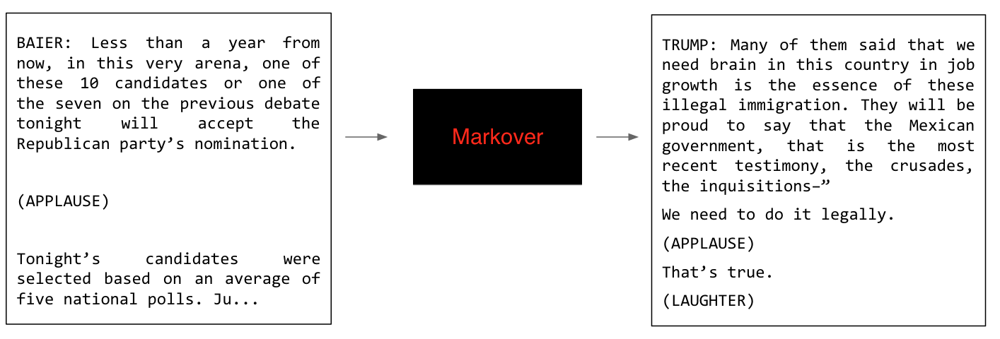

# Markover

Makover is natural language generation, where you'll train a model how to speak and have it generate new text for you. You may use the simplest possible model, but the results may still surprise you in their sophistication. 

## Dependencies
- Python 2.7

## Install
- Install via pip: `$ pip install markover`

## Usage
- `$ markover -t [abs_path_to_your_text_file] -n [length_of_text_to_be_generated] -c (optional)[length_of_chunks_to_be_processed_at_a_time]`

The last argument (-c) is optional. The default value for it is 10 characters per chunk. Try generating texts using various chunks. You should observe that for small c (c= 1, 2, 3), the generated text resembles but is not quite English (or whatever language utilized by your modeled text). For higher order c, the text should start looking more and more like the original text. 

## Enjoy!
- A new text file called "output.txt" is created in the same folder as the file you selected.

## License
- See [License] (LICENSE.txt) file
